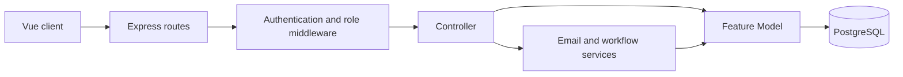

# HEM Model–Controller Architecture

The server currently contains **17 feature models** and **29 controller modules**. Controllers validate HTTP input, authorize the request, coordinate transactions, serialize responses, and trigger notifications. Models own PostgreSQL queries and persistence.

## Feature mapping

| Workflow | Controller modules | Model / repository | Main database data |
|---|---|---|---|
| Authentication and accounts | `authController`, `auth/sessionController`, `auth/accountController` | `UserModel`, `EmailLogModel`, `VoucherModel` | users, profiles, transactional email logs, vouchers |
| Profiles and addresses | `auth/profileController` | `UserModel`, `UserAddressModel` | users, user profiles, addresses |
| Favorites | `auth/favoriteController` | `FavoriteModel` | favorites |
| Search history | `auth/searchHistoryController` | `SearchHistoryModel` | search history |
| Product storefront | `productController`, `product/catalogController` | `ProductModel`, `CatalogModel` | products, variants, images, catalog references |
| Product administration | `product/adminProductController`, `admin/productAdminController` | `ProductModel`, `InventoryModel`, `ReviewModel` | products, inventory, reviews |
| Categories | `admin/catalogAdminController` | `CategoryModel`, `CatalogModel` | categories, departments, product groups |
| Collections | `admin/catalogAdminController` | `CollectionModel`, `CatalogModel` | collections and collection departments |
| Reviews | `reviewController`, `review/productReviewController`, `review/accountReviewController` | `ReviewModel` | product reviews |
| Cart | `cartController`, `cart/readCartController`, `cart/itemCartController` | `CartModel` | carts and cart items |
| Checkout | `order/checkoutController` | `CheckoutModel`, `VoucherModel`, `UserAddressModel` | orders, order items, inventory, voucher redemptions |
| Customer orders | `order/customerOrderController` | `OrderModel`, `ReturnRefundModel`, `CartModel` | orders, history, return/refund summaries |
| Admin orders and payments | `order/adminOrderController` | `OrderModel`, `ReturnRefundModel` | orders, payment review, status history |
| Return and refund | `returnRefundController` | `ReturnRefundModel`, `OrderModel` | return requests/items, refunds, inventory logs |
| Dashboard | `admin/dashboardController` | `DashboardModel` | revenue, order, customer and product statistics |
| Voucher public/admin | `voucherController`, `admin/voucherAdminController` | `VoucherModel` | vouchers and voucher redemptions |
| Inventory administration | `admin/inventoryAdminController` | `InventoryModel` | product inventory and inventory logs |

## Complete commerce workflow for demonstration

1. Member registers, verifies email, and logs in.
2. Member browses products and adds an inventory variant to the database cart.
3. Checkout validates address, voucher, price, and stock inside one transaction.
4. The system creates `orders` and `order_items`, reserves inventory, and records status history.
5. Admin confirms payment where required and moves the order through processing and shipping.
6. Delivery moves to completed after customer confirmation or the configured completion window.
7. Eligible delivered products can enter the itemized return, inspection, inventory, and refund workflow.

## Demo rule

When explaining a feature, follow this path:

`Route → Middleware → Controller → Model → PostgreSQL`

For mutation workflows, also point out that the controller owns `BEGIN / COMMIT / ROLLBACK`, while every business query remains inside a model.
